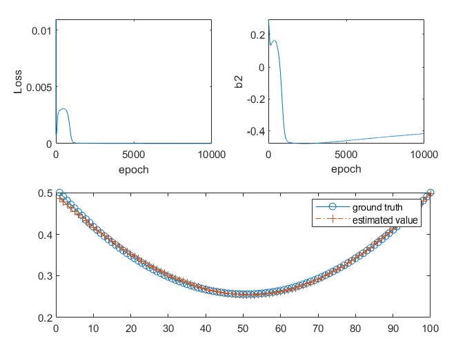

Fully Connected Neural Networks

Two examples are performed in this part. One is for regression (the dim of the output is 1.), the other one is for classification.

In the classification example. Iris data set is used which has 150 samples for three classes, each class has 50 samples. The dim of each sample is 4. the label is one-hot style. For example, [0,1,0] means the sample belongs to Class 2. The dim of input and output of  the neural networks are 4 and 3, respectively.  

Regression：

Classification：

